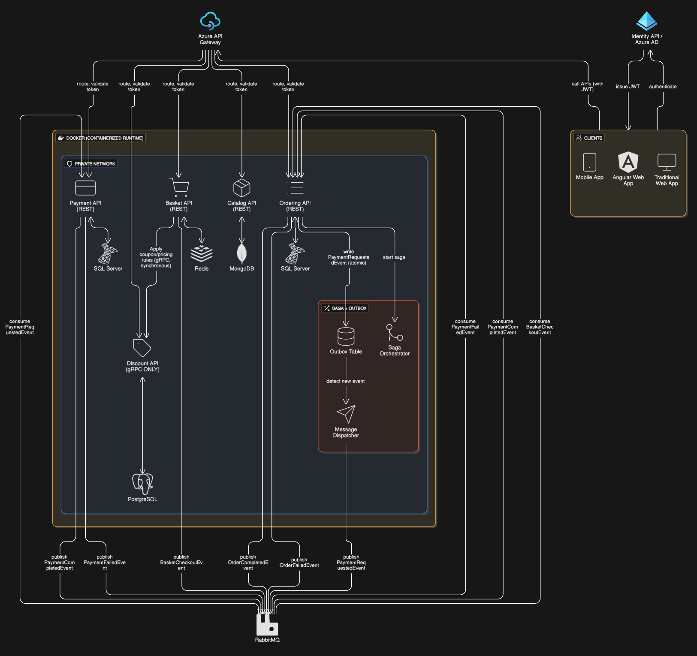
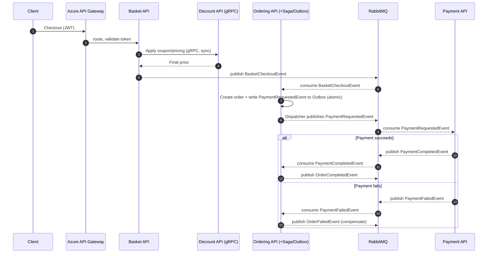

# Clean-Architecture Ecommerce — .NET Web API Backend

A **.NET microservices** e-commerce backend built with **Clean Architecture**, **CQRS**, and an
**event-driven** design. Each service owns its own database, exposes a REST (or gRPC) API behind an
**Azure API Gateway**, and communicates asynchronously through a **RabbitMQ** event bus using the
**Saga** and **Transactional Outbox** patterns.



> The image above is the target architecture. See [Implementation status](#-implementation-status)
> for what is built today versus planned.

---

## 📐 Understanding the diagram

The system is organized in three planes — **clients**, an **edge gateway**, and a set of
**containerized microservices** on a private network — glued together by an asynchronous message bus.

### 1. Clients & identity (top-right)

- **Clients** — a Mobile App, an Angular Web App, and a Traditional Web App.
- **Identity API / Azure AD** — clients **authenticate** against it and receive an **issued JWT**.
- Every subsequent request **calls the APIs with the JWT** so the gateway and services can trust the caller.

### 2. Edge — Azure API Gateway (top-center)

- The single public entry point. For each incoming call it performs **`route, validate token`**:
  it verifies the JWT and forwards the request to the correct internal service.
- Only the REST services are exposed through it — **Payment**, **Basket**, **Catalog**, and **Ordering**.
  The **Discount** service is internal-only (gRPC) and is never reached directly from the edge.

### 3. Runtime — Docker + private network (center)

Everything below the gateway runs inside a **Docker containerized runtime** on a **private network**, so
services and their databases are not publicly reachable. Each microservice owns its **own datastore**
(the "database-per-service" rule):

| Service | Protocol | Datastore | Responsibility |
|---|---|---|---|
| **Payment API** | REST | **SQL Server** | Processes payments; emits payment outcome events |
| **Basket API** | REST | **Redis** | Holds shopping baskets; triggers checkout |
| **Catalog API** | REST | **MongoDB** | Product / brand / type catalog *(implemented today)* |
| **Ordering API** | REST | **SQL Server** | Creates & tracks orders; hosts the saga |
| **Discount API** | **gRPC only** | **PostgreSQL** | Applies coupons / pricing rules |

**Synchronous call:** the **Basket API** calls the **Discount API over gRPC** (`Apply coupon/pricing
rules, synchronous`) while building a basket — a fast, in-request lookup rather than an event.

### 4. Reliable messaging — Saga + Outbox (the red box)

The **Ordering API** must create an order *and* kick off a payment without losing messages if the process
crashes mid-way. It uses the **Transactional Outbox** pattern:

1. When an order needs payment, Ordering **writes `PaymentRequestedEvent` (atomic)** into an **Outbox Table**
   *in the same database transaction* as the order itself — so the event can never be lost or duplicated
   relative to the order.
2. A **Message Dispatcher** continuously **detects new events** in the outbox and publishes them to RabbitMQ.
3. A **Saga Orchestrator** (`start saga`) drives the multi-step checkout workflow and issues
   **compensating actions** when a step fails.

### 5. The event bus — RabbitMQ (bottom)

All asynchronous communication flows through **RabbitMQ**. Services **publish** domain events and
**consume** the ones they care about — they never call each other directly for these flows.

| Event | Published by | Consumed by |
|---|---|---|
| `BasketCheckoutEvent` | Basket API | Ordering API |
| `PaymentRequestedEvent` | Ordering API *(via Outbox → Dispatcher)* | Payment API |
| `PaymentCompletedEvent` | Payment API | Ordering API |
| `PaymentFailedEvent` | Payment API | Ordering API |
| `OrderCompletedEvent` | Ordering API | *(downstream / notifications)* |
| `OrderFailedEvent` | Ordering API | *(downstream / notifications)* |

### End-to-end checkout flow



---

## 🧱 Architecture patterns

- **Clean Architecture** — each service is split into `Core` (domain), `Application` (use cases),
  `Infrastructure` (data / external concerns), and `API` (presentation). Dependencies point inward.
- **CQRS with MediatR** — commands and queries are handled by dedicated handlers.
- **Repository + Specification** — data access is abstracted behind repositories; query parameters
  (search / filter / sort / paging) are expressed as specifications.
- **Database per service** — SQL Server, Redis, MongoDB, and PostgreSQL, each owned by one service.
- **API Gateway** — a single, authenticated entry point.
- **Event-driven messaging** — RabbitMQ for asynchronous, decoupled integration.
- **Saga (orchestration) + Transactional Outbox** — reliable, recoverable distributed workflows.

## 🛠️ Technology stack

- **.NET 8** / ASP.NET Core Web API
- **MediatR** (CQRS)
- **MongoDB** (Catalog) · **Redis** (Basket) · **SQL Server** (Ordering, Payment) · **PostgreSQL** (Discount)
- **RabbitMQ** (event bus)
- **gRPC** (Basket → Discount)
- **Docker** (containerized runtime)
- **Azure API Gateway** & **Azure AD / Identity** (edge + auth)
- **Swagger / Swashbuckle** (API docs)

## 📁 Repository structure

```
Clean-Architecture/
├─ docs/
│  └─ architecture.png              # the diagram above
└─ Ecommerce/
   ├─ Ecommerce.sln
   └─ Services/
      └─ Catalog/                    # Catalog microservice (Clean Architecture)
         ├─ Catalog.Core/            # Entities, repository interfaces, specifications
         ├─ Catalog.Application/     # CQRS: queries, handlers, DTOs, responses, mappers
         ├─ Catalog.Infrastructure/  # MongoDB repositories, settings, seed data
         └─ CatalogAPI/              # ASP.NET Core Web API + Swagger
```

## ✅ Implementation status

| Area | Status |
|---|---|
| **Catalog** service (Core / Application / Infrastructure / API, MongoDB, CQRS) | ✅ Implemented |
| Basket · Ordering · Payment · Discount services | 🚧 Planned |
| RabbitMQ event bus, Saga + Outbox | 🚧 Planned |
| Azure API Gateway, Identity / Azure AD | 🚧 Planned |

## 🚀 Getting started

**Prerequisites:** [.NET SDK 8+](https://dotnet.microsoft.com/download), Docker, and MongoDB
(for the Catalog service).

```bash
# clone
git clone https://github.com/Vickycoder123/Clean-Architecture.git
cd Clean-Architecture/Ecommerce

# restore & build
dotnet restore Ecommerce.sln
dotnet build Ecommerce.sln

# run the Catalog API (Swagger UI available in Development)
dotnet run --project Services/Catalog/CatalogAPI/CatalogAPI.csproj
```

Configure the Catalog service's MongoDB connection under `DatabaseSettings` in
`Services/Catalog/CatalogAPI/appsettings.json`.

---

*Architecture reference implementation — a .NET Clean Architecture microservices backend for e-commerce.*
